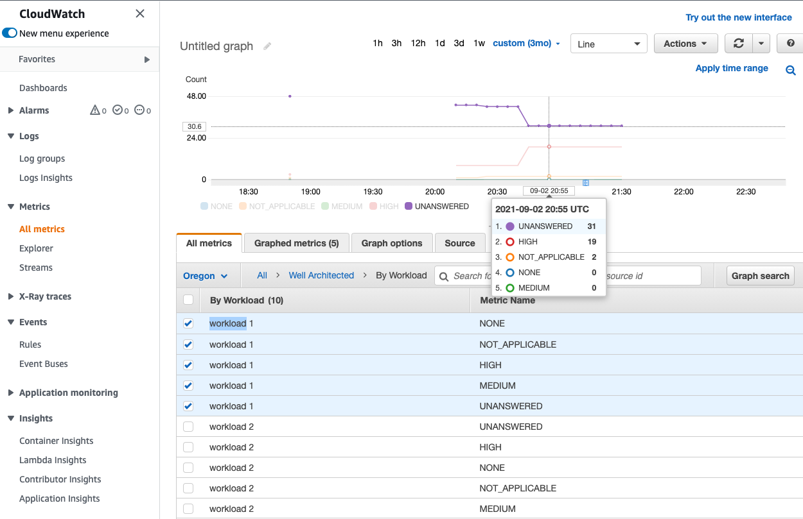

# AWS Well Architected Tool Publish Workload Metrics

## What
This project defines a process to collect and publish cloudwatch metrics for your AWS WA Tool workloads. After metrics are published, dashboards can be generated to display the number of unanswered, high, medium, and not applicable questions for your workloads.

## Why
Being able to visualize work as it progresses throughtout its lifecycle can be beneficial. In addition to visualization via dashboards, cloudwatch alarms can be created to notify your team when workloads have reached various states based on the metrics published. For example, if a workload has more than x unanswered questions, send a notification alerting you team to start addressing the unanswered workload questions.

## How
1. Clone this repo and `cd` into project directory
2. `cd cdk && source .venv/bin/activate`
3. This stack uses assets, so the toolkit stack must be deployed to the environment. Run `cdk bootstrap aws://<YOUR AWS ACCOUNT ID>/<REGION>`
4. `cdk synth && cdk deploy`
5. You wll be prompted with a set of IAM Statement Changes that will made by deploying this CloudFormation template. If you wish to continue with the required changes, type  `y[enter]`

To demonstrate the dashboard, define a Well Architected Tool workload in the AWS console. Name the workload `test` and provide details for the other fields. Click `Start reviewing` to begin answering questions in the workload. The lambda that gets created as part of this project is triggered every 5 minutes and will collect and publish the metrics for each defined workload. 
